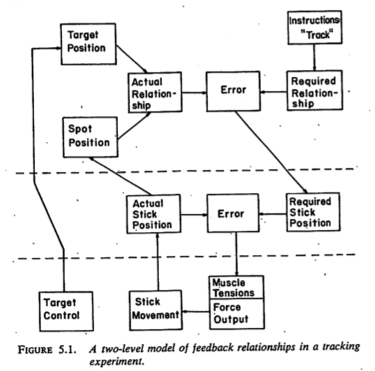

# Preliminaries

```{r set-up, echo=FALSE, warning=FALSE, message=FALSE}
library(databraryapi)
login_db("rogilmore@psu.edu")
```

## Support

<div class="centered">


</br>


</div>

## Agenda

- $D(\Psi) >> D(\Phi)$
- 4 realms and their interactions
- You say you want a revolution...
- Fellow travelers...
- Closing the loop
- Take homes
- Our (essential) open science future

# $D(\Psi) >> D(\Phi)$

---


---


## But why?

---


<!-- The whole elephant -->

---

<p><a href="https://commons.wikimedia.org/wiki/File:Pieter_Bruegel_the_Elder_-_The_Tower_of_Babel_(Vienna)_-_Google_Art_Project.jpg#/media/File:Pieter_Bruegel_the_Elder_-_The_Tower_of_Babel_(Vienna)_-_Google_Art_Project.jpg"></a><br>By <a href="https://en.wikipedia.org/wiki/en:Pieter_Bruegel_the_Elder" class="extiw" title="w:en:Pieter Bruegel the Elder">Pieter Brueghel the Elder</a> - <a rel="nofollow" class="external text" href="//www.google.com/culturalinstitute/asset-viewer/bAGKOdJfvfAhYQ">bAGKOdJfvfAhYQ at Google Cultural Institute</a> zoom level Scaled down from second-highest, Public Domain, <a href="https://commons.wikimedia.org/w/index.php?curid=22178101">Link</a></p>

---

The 'Rumsfeldian' space of knowledge

| | |
|------------------|------------------|
| known-knowns | known-unknowns |
| unknown-knowns | unknown-unknowns |

---

The 'Rumsfeldian' space of knowledge

| | |
|------------------|------------------|
| known-knowns | known-unknowns |
| **unknown-knowns** | unknown-unknowns |

---


<!-- - What does psychology aim to understand? -->

---


<!-- Definition of psychology -->

## Oh give me a 'ome...

- [Genome](https://www.genome.gov/12011238/an-overview-of-the-human-genome-project/)
- [Proteome](https://hupo.org/human-proteome-project)
- [Metabolome](http://www.hmdb.ca/)
- [Connectome](http://www.humanconnectomeproject.org/)
- Behaviorome?

---

>"*Behavior is the linchpin of the most vexing problems in public health, and a better understanding of behavior is fundamental to achieving positive health outcomes, from prenatal development throughout adulthood.*"

[Gilmore, Adolph, & Tamis-LeMonda, 2019](https://www.rick-gilmore.com/post/behavior-is-the-linchpin/)

---

>"*Behavior contributes to the progression or prevention of disease, defines a disorder or marks recovery, and provides mechanisms for therapeutic intervention.*"

[Gilmore, Adolph, & Tamis-LeMonda, 2019](https://www.rick-gilmore.com/post/behavior-is-the-linchpin/)

## What to do about it?

# 4 realms and their interactions

---


---

| Realm               | Domain               |
|---------------------|----------------------|
| $W$   | The world |
| $B$   | The body |
| $N$   | The nervous system |
| $M$   | The mind |

## Nested causality

- Mind ($M$) within nervous system ($N$)
- Nervous system ($N$) within body ($N$)
- Body ($B$) within world ($W$)

## Mutual coupling of dynamic states

$\dot{M} = f(M,N)$

$\dot{N} = f(N,B)$

$\dot{B} = f(B,N,W)$

$\dot{W} = f(W,B)$

## Measure

- $W$, $B$, $N$ **directly**
- At varied spatial & temporal scales

---

<a href="">

</a>

[Sejnowski, Churchland, & Movshon, 2014](http://doi.org/10.1038/nn.3839)


## Measure

- $M$ **indirectly**
- Only via $N$, $B$

## $M$ highly salient, but...


<!-- Fox on an iceberg. Like iceberg, belies bulk below. -->

---

<p><a href="https://commons.wikimedia.org/wiki/File:Blackbox3D-withGraphs.png#/media/File:Blackbox3D-withGraphs.png"></a><br>By <a href="//commons.wikimedia.org/wiki/User:Krauss" title="User:Krauss">Krauss</a> - <span class="int-own-work" lang="en">Own work</span>, <a href="https://creativecommons.org/licenses/by-sa/4.0" title="Creative Commons Attribution-Share Alike 4.0">CC BY-SA 4.0</a>, <a href="https://commons.wikimedia.org/w/index.php?curid=45608217">Link</a></p>

---


---

> "*How should an experimenter proceed when faced with a black box?*"

[Ashby, 1956/2015](https://www.amazon.com/Introduction-Cybernetics-W-Ross-Ashby/dp/1614277656), 6/2

---

> "*What properties of the Box's contents are discoverable and what are fundamentally not discoverable?*"

[Ashby, 1956/2015](https://www.amazon.com/Introduction-Cybernetics-W-Ross-Ashby/dp/1614277656), 6/2

---

> "*What methods should be used if the Box is to be investigated efficiently?*"

[Ashby, 1956/2015](https://www.amazon.com/Introduction-Cybernetics-W-Ross-Ashby/dp/1614277656), 6/2

---

> "*The primary data of any investigation of a Black Box consists of a sequence of values of the vector with two components: (input state, output state).*"

[Ashby, 1956/2015](https://www.amazon.com/Introduction-Cybernetics-W-Ross-Ashby/dp/1614277656), 6/5

---

> "*From this there follows the fundamental deduction that all fundamental knowledge obtainable from a Black Box (of given input and output) is such as can be obtained by re-coding the protocol [sequence of input/output measurements].*"

[Ashby, 1956/2015](https://www.amazon.com/Introduction-Cybernetics-W-Ross-Ashby/dp/1614277656), 6/5

---

> "*What is being suggested now is not that Black Box behavior is somewhat like real objects, but that the real objects are in fact all Black Boxes, and that we have in fact been operating with Black Boxes all our lives.*"

[Ashby, 1956/2015](https://www.amazon.com/Introduction-Cybernetics-W-Ross-Ashby/dp/1614277656), 6/18

---

> "*The theory of the Black Box is simply the study of the relations between the experimenter and his environment, when special attention is given to the flow of information.*"

[Ashby, 1956/2015](https://www.amazon.com/Introduction-Cybernetics-W-Ross-Ashby/dp/1614277656), 6/18

# You say you want a revolution...

---


B.F. Skinner

## $S \rightarrow R$ psychology

- $S$ (stimulus) -> $R$ (response)
- $S$ and $R$ observable

---

```{r, echo=FALSE, message=FALSE, warning=FALSE}
library(igraph)
el <- rbind(c("W","S"), c("S","B"), c("B","R"), c("R","W"))
g0 <- graph_from_edgelist(el)
g0$layout <- layout_in_circle
plot(g0, vertex.size=50, vertex.color="gray")
```

---

- $S$ is the effect of some $W_i$ on $B$
- $R$ is some change in $B$ ($\dot{B_i}$) that is observable in $W$
    
---


Noam Chomsky

## $S \rightarrow C \rightarrow R$

- $S$ (stimulus) -> $C$ (cognition/computation) -> $R$ (response)
- $C$ inferred from structure in $S$->$R$
- $C$ elaborate, probably innate
- $S$ alone insufficient to explain $C$, especially language [(Chomsky, 1959)](http://cogprints.org/1148/1/chomsky.htm)

## The cognitive 'revolution'

- $C$ ($M$) viewed in *algorithmic* terms
- Formal operations on information structures
- Developed in parallel with computer science, AI

---

<!-- Michael Gazzaniga -->


## The cognitive (neuroscience) 'revolution'

- Developed alongside cognitive science
- $C (M) \leftrightarrow N$
- What $N_i$ compute functions of $C (M)$?
- Assume 1:1 relationship between $N$ and $C (M)$

---


<!-- Fodor's Modularity of Mind -->

---


<!-- Phrenology -->

## The problem with revolutions...


<!-- "Is that something is always lost..." -->

## Linear/open-loop causal chains

- $S \rightarrow R$ 
- $S \rightarrow C \rightarrow R$

## vs. *closed-loop* causal chains

```{r, echo=FALSE, message=FALSE, warning=FALSE}
#library(igraph)
el <- rbind(c("C","R"), c("R","W"), c("W","S"), c("S","C"))
g <- graph_from_edgelist(el)
g$layout <- layout_in_circle
plot(g, vertex.size=50, vertex.color="gray")
```

---

$R$ (actions) create effects in the World ($W$)

$W$ states induce sensations ($S$)

$S$ affect $C$ (computations/cognitions)

$C$ affect $A$

...

## Consequences...

- Properties of $W$ downplayed, ignored
- Why are $S$ or $C$ causal but not $R$?
- *Variability* in behavior $R$ only noise
- *Origins* of $R$, $C$, $A$?
- $W \leftrightarrow B \leftrightarrow N$ reflect ontogenetic and phylogenetic history

---

<!--  -->


---


---

<!-- | | | -->
<!-- |------------------|------------------| -->
<!-- | known-knowns | known-unknowns | -->
<!-- | **unknown-knowns** | unknown-unknowns | -->

<!-- --- -->

>"*Reports that say that something hasn't happened are always interesting to me, because as we know, there are known knowns; there are things we know we know.*" 

<https://en.wikipedia.org/wiki/There_are_known_knowns>

---

>"*We also know there are known unknowns; that is to say we know there are some things we do not know.*" 

<https://en.wikipedia.org/wiki/There_are_known_knowns>

---

>"*But there are also unknown unknowns—the ones we don't know we don't know. And if one looks throughout the history of our country and other free countries, it is the latter category that tend to be the difficult ones.*"

<https://en.wikipedia.org/wiki/There_are_known_knowns>

## The 'unknown-known' of cybernetics

## [Alan Turing's letter to Ross Ashby (~1946)](https://www.bl.uk/collection-items/letter-from-alan-turing-to-w-ross-ashby)

---

<!-- Turing -->


<!-- Ashby -->


---

>"*In working on the ACE [Automatic Computing Engine] I am more interested in the possibility of producing models of the action of the brain than in the practical applications to computing.*"

[Turing's letter to Ashby, 1946](https://www.bl.uk/collection-items/letter-from-alan-turing-to-w-ross-ashby)

---

>"*The ACE will be used, as you suggest,...in an entirely undisciplined manner, similar to the action of the lower centres, although the reflexes are extremely complicated.*"

[Turing's letter to Ashby, 1946](https://www.bl.uk/collection-items/letter-from-alan-turing-to-w-ross-ashby)

---

>"*The disciplined action carries with it the disagreeable feature, which you mentioned, that it will be entirely uncritical when anything goes wrong.*"

[Turing's letter to Ashby, 1946](https://www.bl.uk/collection-items/letter-from-alan-turing-to-w-ross-ashby)


---

>"*It will also be necessarily be devoid of anything that could be called originality.*"

[Turing's letter to Ashby, 1946](https://www.bl.uk/collection-items/letter-from-alan-turing-to-w-ross-ashby)

---

>"*It would be quite possible for the machine to try out variations in behaviour and accept or reject them in the manner you describe, and I have been hoping to make the machine do this...*"

[Turing's letter to Ashby, 1946](https://www.bl.uk/collection-items/letter-from-alan-turing-to-w-ross-ashby)

## Ashby's homeostat


---


<!-- Homeostat -->

# Fellow travelers...

## In neuroscience

<a href="https://doi.org/10.1016/j.neuron.2016.12.041">

</a>

<!-- Krakauer paper title -->

---

<div class="centered">

</div>

---

<div class="centered">

</div>

---

<div class="centered">

</div>

## Algorithms vs. Dynamics ([Van Gelder, 1995](http://dx.doi.org/10.2307/2941061))

- How to regulate the speed of a steam engine?

---

<p><a href="https://commons.wikimedia.org/wiki/File:Maquina_vapor_Watt_ETSIIM.jpg#/media/File:Maquina_vapor_Watt_ETSIIM.jpg"></a><br>By Nicolás Pérez, <a href="http://creativecommons.org/licenses/by-sa/3.0/" title="Creative Commons Attribution-Share Alike 3.0">CC BY-SA 3.0</a>, <a href="https://commons.wikimedia.org/w/index.php?curid=195711">Link</a></p>

---

```
1. Measure the speed of the flywheel.
2. Compare the actual speed against the desired speed.
3. If there is no discrepancy, return to step 1. Otherwise,
    a. measure the current steam pressure;
    b. calculate the desired alteration in steam pressure;
    c. calculate the necessary throttle valve adjustment.
4. Make the throttle valve adjustment.
5. Return to step 1. 
```

---

<p><a href="https://commons.wikimedia.org/wiki/File:Centrifugal_governor.png#/media/File:Centrifugal_governor.png"></a><br>By R. Routledge - Image from "Discoveries &amp; Inventions of the Nineteenth Century" by R. Routledge, 13th edition, published 1900., Public Domain, <a href="https://commons.wikimedia.org/w/index.php?curid=231047">Link</a></p>

## David Marr & J.J. Gibson
<!-- David Marr -->


<!-- J.J. Gibson -->


## What if we took Marr too literally?

- Computational theories matter
- Algorithms matter
- Hardware matters

---


<!-- Story of Rick and the 8-queens problem -->

## *Biological* computing

- Constrained by space, time, energy

---


25 W vs. ?? MW

<!-- Alpha Go vs. Ke Jie -->

## *Biological* computing

- Computes with chemistry (when possible), and 'wires' (when necessary)

---


<!-- Sterling and Laughlin -->

## *Biological* computing

- Engages in real-time behaviors with existential consequences (e.g., ingestion, defense, reproduction, locomotion, pursuit)
- Interacts with and in dynamic environments

---

<iframe width="560" height="315" src="https://www.youtube.com/embed/9nxoSRasq2Q" frameborder="0" allow="accelerometer; autoplay; encrypted-media; gyroscope; picture-in-picture" allowfullscreen></iframe>

<!-- Video of Euglena in locomotion -->

## *Biological* computing

- Separate neural 'streams' for $S \leftrightarrow C \leftrightarrow A$

---

<div class="centered">


[Swanson, 2005](http://dx.doi.org/10.1002/cne.20733)
</div>

---

<div class="centered">


[Swanson, 2005](http://dx.doi.org/10.1002/cne.20733)
</div>

## Am I my connectome?

<div style="max-width:854px"><div style="position:relative;height:0;padding-bottom:56.25%"><iframe src="https://embed.ted.com/talks/sebastian_seung" width="854" height="480" style="position:absolute;left:0;top:0;width:100%;height:100%" frameborder="0" scrolling="no" allowfullscreen></iframe></div></div>

---

> "*What we know from C. elegans and the crustacean stomatogastric ganglion, with networks involving very few neurons, is that we haven't a clue how they work even with the essential addition of electrophysiology.*"

[Costandi, 2012](https://www.theguardian.com/science/neurophilosophy/2012/sep/21/connectome-review)

---

> "*So, while SS's memorable (if pukeworthy) 'I am more than my genome, I am my connectome' may be true in a grossly superficial way, they are not going resolve connectional issues in any useful way using their current approaches.*"

[Costandi, 2012](https://www.theguardian.com/science/neurophilosophy/2012/sep/21/connectome-review)

---

> "*So, while SS's memorable (if pukeworthy) 'I am more than my genome, I am my connectome' may be true in a grossly superficial way, they are not going resolve connectional issues in any useful way using their current approaches.*"

[Costandi, 2012](https://www.theguardian.com/science/neurophilosophy/2012/sep/21/connectome-review)

---


[Jonas & Kording, 2017](https://doi.org/10.1371/journal.pcbi.1005268)

---

>"*We show that [classic analytic neuroscience] approaches reveal interesting structure in the data but do not meaningfully describe the hierarchy of information processing in the microprocessor.*" 

[Jonas & Kording, 2017](https://doi.org/10.1371/journal.pcbi.1005268)

---

>"*This suggests current analytic approaches in neuroscience may fall short of producing meaningful understanding of neural systems, regardless of the amount of data.*"

[Jonas & Kording, 2017](https://doi.org/10.1371/journal.pcbi.1005268)

# Closing the loop

## Perceptual Control Theory (PCT)

---


William T. Powers

---


[Powers, 1973](https://www.amazon.com/Behavior-Perception-William-T-Powers/dp/0964712172)

---


[Powers, 1973](https://www.amazon.com/Behavior-Perception-William-T-Powers/dp/0964712172)

## Tenets of PCT

- *Perception* is the source of controlled variables
- *Actions* control perception with respect to some referent signal
- Nested hierarchies of perceptual control systems

---


[Wang et al. 2012](https://doi.org/10.1016/j.sysarc.2012.06.004)

<!-- Hierarchical control illustration -->

---

## Related approaches

- Dynamic Systems Theory (DST) (Van Gelder)
- Ecological Psychology (e.g., Gibson, Turvey)
- Forward models (e.g., Shadmehr & Mussa-Ivaldi; Wolpert)
- Cognitive control/Executive functions
- Reafference, Helmholtzian 'unconscious inference'

## What is being controlled?

- Control illustrates the purposive dimension of behavior (Tolman)
- Perceptual states (PCT) vs. actions (Ecological psychologists, forward modelers)
- Mappings from $S \rightarrow R$ and $C \rightarrow C$ (cognitive control/executive functions)

## What do animals control?

## Internal states
    
- Hunger, thirst, activity/arousal level, temperature, ...

---


<!-- Bart Simpson homeostasis -->

---


<!-- Multiple loops for thermoregulation -->

---

- Mental states (mood, thought processes)?

## External states
    
- Direction/position/motion of sensory organs
- Body postures, movements in space
- Emissions (e.g., sound)
- Secretions
    
## Visuo-motor pursuit



[Powers, 1973](https://www.amazon.com/Behavior-Perception-William-T-Powers/dp/0964712172)

<!-- ## Fruitful lines -->

<!-- - Properties of $W$ and of $A$->$W$->$P$ -->
<!-- - Events in $W$ specified by multiple $P_i$ -->
<!-- - Topographic maps -->
<!-- - 'Fourier'-like mappings common -->

<!-- ## Fruitful lines -->

<!-- - Measuring 'controlled variables' in $N$ and $B$ -->
<!-- - Explains spontaneous (arising from $M$/$N$) behaviors -->
<!-- - Effects of responses to stimuli $S$ (events in $W$ or $\dot{W}$) are perturbations to existing set of controlled variables -->

## Challenges

- Deep 'theories of tasks' 
- Amenable to control variable analyses

---


[Powers, 1973](https://www.amazon.com/Behavior-Perception-William-T-Powers/dp/0964712172)

## Challenges

- But which tasks?

---

<div class="centered">

</div>

Krakauer et al., 2017

## Criteria for task selection

- Ethological relevance
- Transparent control variables
- Measurable state spaces
- Rich 'computational' theory of the task

## Peripheral control points

- Vision: direction of gaze, eyes open/closed, pupil diameter, lens thickness
- Audition: head position, ears covered/un-, acoustic/stapedius reflex, outer hair cells in cochlea 

## Locomotion

- Foundational example of "knowing" (Turvey)
- Systematic, often rhythmic changes in body configuration
- Produce forces that propel organism
- Control variables: speed, heading direction, posture

## Embedded within locomotion

- Perceiving a 'locomotable' trajectory
- Perceiving stable body posture

## Perceiving a 'locomotable' trajectory

- From vision/audition -> surface layout
- From kinesthesia -> body orientation relative to contact surface

## Constraints on 'locomotable' trajectory

- Wide enough to permit passage of body (geometric properties)
- In general direction of desired heading (geometric properties)
- Direction toward or away depending on valence of target(s)

---


[Fajen & Warren 2003](https://psycnet.apa.org/doi/10.1037/0096-1523.29.2.343)

## Constraints on 'locomotable' trajectory

- With suitable supporting surface (friction, support rigidity, size)
- With sufficient 'clearance' to avoid collision or injury

## Controlling speed

- From proprioception -> energy expenditure, limb movement rate, respiration and heart rate
- From vision -> optical flow (as a function of distance)
- From audition -> change in heard azimuth, elevation
- From vestibular sense -> $\int{\ddot{x}dx}$

## Perceiving stable body posture

- From vestibular sense -> linear and angular head accelerations (gravity +)
- From kinesthesia -> body configuration and Center of Mass (CoM)
- From kinesthesia -> base of support

## Perceiving surface layout (visually)

- Stabilize gaze direction (despite head/body movements)
- Regulate binocular fixation
- Sample visual field
- Regulate optical focus

## Stabilizing gaze direction

- Vestibulo-ocular Response (VOR)
- Optokinetic Nystagmus
- Pursuit
- Saccades & microsaccades

## Controlling posture

- Righting reflex (relative to gravity)
- Myotatic reflexes (relative to target joint angle configuration)

## Challenges

- Characterizing states
- Characterizing state transitions
- Is bigger better?

---

| A | B | C | D | E | F | G |
|---|---|---|---|---|---|---|
| B | C | D | D | F | G | A |

---

```{r, echo=FALSE, message=FALSE, warning=FALSE}
library(igraph)
el <- rbind(c("A","B"), c("B","C"), c("C","D"), c("D","E"), c("E", "F"), c("F", "G"), c("G", "A"))
g2 <- graph_from_edgelist(el)
g2$layout <- layout_in_circle
plot(g2, vertex.size=50, vertex.color="gray")
```

---

| A | H | H | H | H | F | H |
|---|---|---|---|---|---|---|
| H | H | H | H | F | H | A |

---

```{r, echo=FALSE, message=FALSE, warning=FALSE}
library(igraph)
el <- rbind(c("A","H"), c("H","H"), c("F", "H"), c("H", "A"))
g3 <- graph_from_edgelist(el)
g3$layout <- layout_in_circle
plot(g3, vertex.size=50, vertex.color="gray")
```

---

| A | B | C | D | E | F | G |
|---|---|---|---|---|---|---|
| B | C | D | D | F | G | A |

"Rhymes with B" -> H

| A | H | H | H | H | F | H |
|---|---|---|---|---|---|---|
| H | H | H | H | F | H | A |

Inspired by [Ashby, 1956/2015](https://www.amazon.com/Introduction-Cybernetics-W-Ross-Ashby/dp/1614277656)

## Challenges

- Dimensionality of input stream ($S$) state spaces
- Energy (EM, mechanical, thermal) or material fields in $W$
<!-- - Receptor (photoreceptors, cochlear hair cells,...) -->
<!-- - Cranial nerve projections -->
<!-- - Topographic mappings in thalamus, cortex... -->

---

Plenoptic function (Adelson & Bergen, 1991)


$P(\theta,\phi,\bar{\lambda},t,V_{x},V_{y},V_{z})$. 

---

$(V_{x},V_{y},V_{z})$: locations in $W$

$(\theta,\phi)$: optic axis, usually aligned with $V_{z}$

$\bar{\lambda}$: wavelength distribution

## Challenges

- Most biologically meaningful events are multimodal
- Handling mixtures of (within or between mode) perceptual signals?

---

e.g., object distance from vision (monocular, binocular, motion cues, ...)

object distance from audition, olfaction, proprioception, or

body posture from vision, vestibular proprioception, muscle/joint proprioception

---

$P(t)=\sum_{i=1}^n w_{i}(t)S_{i}(t)$

$\sum_{i=1}^n w_{i}(t) = 1$

## Challenges

- Characterizing statistics of the perceptual environment...
- Natural scene statistics

---


[Geisler, 2008](https://doi.org/10.1146/annurev.psych.58.110405.085632)

## Challenges

- States of perceptual environment across ontogenetic development...

---

```{r, results='asis', echo=FALSE}
source("R/write_video_clip_html.R")
write_video_clip_html("https://nyu.databrary.org/slot/7739/0,26134/asset/16749/download?inline=true", vid_w_pix = 640, vid_h_pix = 480, show_link = FALSE)
```

[Gilmore et al., 2015](http://doi.org/10.17910/B7.116)

---

```{r, results='asis', echo=FALSE}
write_video_clip_html("https://nyu.databrary.org/slot/7739/0,26634/asset/16747/download?inline=true", vid_w_pix = 640, vid_h_pix = 480, show_link = FALSE)
```

<!-- Gilmore, R.O., Raudies, F., Franchak, J. & Adolph, K. (2015). Understanding the development of motion processing by characterizing optic flow experienced by infants and their mothers. Databrary. Retrieved March 26, 2019 from http://doi.org/10.17910/B7.116 -->

[Gilmore et al., 2015](http://doi.org/10.17910/B7.116)

---


## Visual motion statistics differ across age due to

- Changes in body posture (crawling vs. walking)
- Locomotor speed
- Increasingly stable gaze

---

```{r, results='asis', echo=FALSE}
write_video_clip_html("https://nyu.databrary.org/slot/34/0,392902/asset/9218/download?inline=true", vid_w_pix = 640, vid_h_pix = 480, show_link = FALSE)
```

[Adolph, 2013](http://doi.org/10.17910/B7RP4H)

## Even earlier ontogenetic origins

- Spontaneous activity
- In retina (e.g., Shatz)
- In muscles (twitching; Blumberg)

## Challenges

- Behaviors sequential, multivariate
- Mixtures of control laws...

---

Crawl/walk to mom + keep balance + stabilize gaze + look around + ...

---

$A(t)=\sum_{i=1}^n w_{i}(t)F_{i}$

$\sum_{i=1}^n w_{i}(t) = 1$

## Challenges

- Temporal delays
- Info from simultaneous events propagates at speeds differing by 100x
- Need theory of 'psycho/neural' relativity?
- Comparable challenges for output streams

<!-- --- -->

<!-- ```{r, echo=FALSE, message=FALSE, warning=FALSE} -->
<!-- library(ggplot2) -->
<!-- library(tidyverse) -->
<!-- nerve <-read.csv('csv/nerve-conduction.csv') -->
<!-- nerve <- nerve %>% -->
<!--   gather(key="diameter_stat", value="diameter", diameter_min, diameter_max) %>% -->
<!--   gather(key='speed_stat', value = 'speed', conduction_min, conduction_max) -->
<!-- nerve %>%  -->
<!--   ggplot(.) + -->
<!--   aes(x = diameter, y = speed, color = myelin) + -->
<!--   geom_point() + -->
<!--   ylab('m/s') + -->
<!--   xlab(bquote("axon diameter" ~ mu*m)) + -->
<!--   ggtitle('Speed of neural conduction') -->
<!-- ``` -->

## Challenges

- Access to sufficiently rich datasets with multiple state variables
- Clear specification of controlled systems & control variables
- Widespread open sharing
- Imagine easy 'meta-analyses' of control variables & dynamical relationships

---

<div class="centered">

</div>

Krakauer et al., 2017

## Despite the challenges

- Many (most?) are 'known-unknowns'

# Take homes

---


<!-- Nested causality -->

---

```{r, echo=FALSE, message=FALSE, warning=FALSE}
plot(g, vertex.size=50, vertex.color="gray")
```

---

| Algorithms | Dynamics |
|------------|----------|
| for x in range(0, n): | $\dot{x}=f(x,a)$  |

Different ways to characterize Black Boxes

---


[(Maunsell)](https://slideplayer.com/slide/4374326/)

<!-- History of cybernetics, how lost to cognitive science -->

---


---


[(Wang et al. 2012)](https://doi.org/10.1016/j.sysarc.2012.06.004)

<!-- Hierarchical control illustration -->

<!-- --- -->

<!-- Suggests an 'outside-in' approach to inquiry. Characterizing behaviors (or physiological states) where the perceptual control dynamics are well-enough known. -->
<!-- Embrace multisensory flows. -->
<!-- If we understand these dynamics sufficiently well, they will illuminate the $M$/$N$. Quote from Turvey & Shaw? -->

---

<div class="centered">


[Swanson, 2005](http://dx.doi.org/10.1002/cne.20733)
</div>

## Complicate before simplifying?

---


## And yet...

1. An organism in some state of relative constancy ($\dot{B}<\epsilon$) is under the influence of one or more control systems.
1. $\dot{B}=f(B,N,W)$
1. For every $R_i$ ($\dot{B_i}$) there is some $S_i$ ($\dot{B_i}$ or $\dot{W_i}$)
...

# Our (essential) open science future

## Is there a reproducibility crisis in science?

- Yes, a significant crisis
- Yes, a slight crisis
- No crisis
- Don't know

---

<div class="centered">

</br>
<small>
([Baker, 2016](http://doi.org/10.1038/533452a))
</small>
</div>

## Have you failed to reproduce an experiment from your lab or someone else's?

---

<div class="centered">

</br>
<small>([Baker, 2016](http://doi.org/10.1038/533452a))</small>
</div>

<div class="notes">
</div>

## Why this matters

---

>"*The advancement of detailed and diverse knowledge about the development of the world’s children is essential for improving the health and well-being of humanity…*"

---

>"*We regard scientific integrity, transparency, and openness as essential for the conduct of research and its application to practice and policy…*"

<https://www.srcd.org/about-us/policy-scientific-integrity-transparency-and-openness>

## Open science will accelerate discovery

- Open sharing of materials, analysis code, & data
- Causal/dynamic models in discoverable formats
- Video + physio + other temporally dense time series?
- [Databrary.org](https://databrary.org)

## An openly-shared 'behaviorome'

---

```{r, results='asis', echo=FALSE}
write_video_clip_html("https://nyu.databrary.org/slot/27087/0,372193/asset/119877/download?inline=true", vid_w_pix = 640, vid_h_pix = 480, show_link = FALSE)
```

---


<!-- The whole elephant -->

---

<div class="centered">


<!-- Girl hugging elephant -->

---

<video width="800" data-autoplay>
  <source src="https://github.com/gilmore-lab/DEVSEC-2018/blob/master/mov/databrary-splash.mp4?raw=true" type="video/mp4">
  </video>
rogilmore@psu.edu</br>
<https://gilmore-lab.github.io></br>
<https://gilmore-lab.github.io/2019-03-25-cne/></br>
[\@rogilmore](https://twitter.com/rogilmore)

# Materials

This talk was produced on `r Sys.Date()` in [RStudio](http://rstudio.com) version using R Markdown and the reveal.JS framework.
The code and materials used to generate the slides may be found at <https://github.com/gilmore-lab/2019-03-28-cne/>.
Information about the R Session that produced the code is as follows:

---

```{r session-info}
sessionInfo()
```
